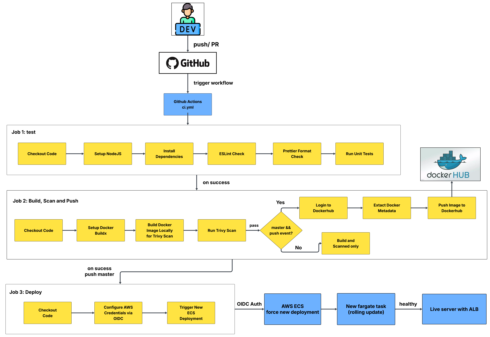
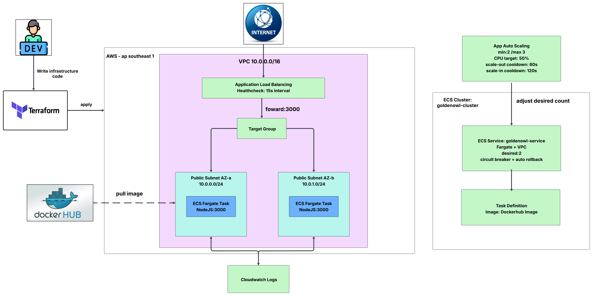

# Golden Owl DevOps Internship - Technical Challenge Solution 🚀

This repository contains the complete implementation for the **Golden Owl DevOps Internship Challenge**. It features an automated end-to-end CI/CD pipeline, an optimized & secure Docker container, and a high-availability, auto-scaling cloud infrastructure provisioned entirely with Terraform on AWS.

---

## 📌 Submission Summary

* **Public Repository**: [goldenowl-devops-internship-challenge](https://github.com/vantai162/goldenowl-devops-internship-challenge)
* **Live Deployment URL**: [http://goldenowl-alb-881304036.ap-southeast-1.elb.amazonaws.com](http://goldenowl-alb-881304036.ap-southeast-1.elb.amazonaws.com)
* **DockerHub Registry**: [`vantai162/goldenowl-app`](https://hub.docker.com/r/vantai162/goldenowl-app)
* **Final Docker Image Size**: **198 MB** (compressed: **49.1 MB**)

---

## 🎨 Visual Flow Diagrams

### 1. CI/CD Workflow


### 2. AWS Infrastructure Architecture


---

## 🌟 Key Features & Highlights

### 1. Docker Image Optimization & Hardening
* **Multi-stage Build**: Separates production dependency installation (`npm ci --omit=dev`) from the final runtime container.
* **Minimal Base Image**: Built on `node:20-alpine` to maintain a tiny footprint and minimal attack surface.
* **Security & Non-root Execution**: Runs as the unprivileged user `USER node` instead of `root`.
* **Package Stripping**: Removed unused package managers (`npm`, `npx`, `corepack`, `yarn`) from the runtime image to reduce image size and eliminate potential CVE vulnerabilities.
* **Clean Context**: Strict `.dockerignore` to prevent uploading node_modules, tests, documentation, and local configuration files into the build context.

### 2. CI/CD Pipeline (GitHub Actions)
The workflow defined in [`.github/workflows/ci.yml`](.github/workflows/ci.yml) consists of 3 distinct, gated jobs:

1. **Job 1: Test & Quality Checks**
   * Checks out code, sets up Node.js 20 with npm caching.
   * Runs **ESLint** (`npm run lint:check`), **Prettier** (`npm run format:check`), and **Unit Tests** (`npm test`).
2. **Job 2: Docker Build, Trivy Security Scan & Push**
   * Sets up Docker Buildx with GitHub Actions caching (`type=gha`).
   * Builds the image locally and performs a vulnerability scan with **Aqua Security Trivy** (fails on `CRITICAL` or `HIGH` vulnerabilities).
   * Automatically extracts metadata and tags (`latest`, `sha-<short>`).
   * Pushes to DockerHub only on verified `push` events to `main`/`master` branches.
3. **Job 3: Continuous Deployment (CD) with AWS OIDC**
   * Authenticates securely with AWS IAM using **OpenID Connect (OIDC)** federated role assumption (zero long-lived credentials/secrets stored in GitHub).
   * Triggers zero-downtime rolling update via `aws ecs update-service --force-new-deployment`.

### 3. AWS Cloud Infrastructure (Terraform IaC)
All cloud resources in Singapore region (`ap-southeast-1`) are 100% managed via Terraform in the [`infra/`](infra/) directory:

* **Networking**: Custom VPC (`10.0.0.0/16`) across 2 Availability Zones with Public Subnets (`10.0.0.0/24`, `10.0.1.0/24`) and Internet Gateway.
* **Application Load Balancer (ALB)**: Distributes incoming HTTP traffic on port `80` to target group on port `3000` with automated health checks (`15s` interval).
* **ECS Fargate Cluster & Service**: Serverless container execution with `desired_count = 2`.
* **Zero-Downtime Rollback (Bonus)**: Configured **Deployment Circuit Breaker** with automatic rollback on deployment failures.
* **Application Auto Scaling**:
  * Scalable range: **Min 2** / **Max 3** tasks.
  * Target tracking scaling policy maintaining **50% average CPU utilization** (Scale-out cooldown: `60s`, Scale-in cooldown: `120s`).
* **Centralized Logging**: CloudWatch Log Group (`/ecs/goldenowl`) with 7-day retention.
* **Security Groups**: Principle of least privilege (ALB accepts public HTTP traffic; ECS tasks accept traffic strictly from the ALB security group).

---

## 🏆 Bonus Checklist

- [x] **Infrastructure as Code (IaC)**: Fully written in modular Terraform configuration.
- [x] **Image vulnerability scan in CI**: Integrated Trivy scan in CI pipeline blocking insecure images.
- [x] **Automatic rollback on failed deployment**: Enabled on ECS Service for fault tolerance.
- [ ] **HTTPS on the load balancer**: Didnt finish on time.

---

## Local Development & Testing

### 1. Run Node.js Application Locally
```bash
cd src
npm install
npm run lint:check
npm test
npm start
```
Verify the server:
```bash
curl http://localhost:3000/
# Expected: {"message":"Welcome warriors to Golden Owl!"}
```

### 2. Build and Run Docker Container Locally
```bash
# Build image
docker build -t goldenowl-app:latest .

# Run container
docker run -d -p 3000:3000 --name goldenowl-app goldenowl-app:latest

# Check status
curl http://localhost:3000/
```

### 3. Provision Infrastructure with Terraform
```bash
cd infra
terraform init
terraform plan
terraform apply
```

---

## 📂 Project Structure

```text
.
├── .github/workflows/
│   └── ci.yml               # Complete CI/CD Pipeline (Lint, Test, Trivy Scan, DockerHub, Deploy)
├── docs/
│   ├── CICD_flow.png        # CI/CD Workflow diagram
│   └── aws_architecture.png # Cloud architecture diagram
├── infra/
│   ├── alb.tf               # Application Load Balancer & Target Groups
│   ├── autoscaling.tf       # ECS Target Tracking Auto Scaling Policy
│   ├── ecs.tf               # ECS Cluster, Task Definition & Fargate Service
│   ├── github_oidc.tf       # IAM Role & OIDC trust policy for GitHub Actions
│   ├── network.tf           # VPC, Subnets, IGW, Route Tables
│   ├── output.tf            # Terraform Output variables
│   ├── security.tf          # Security Groups for ALB & ECS
│   ├── variable.tf          # Terraform Variable definitions
│   └── version.tf           # AWS Provider requirements
├── src/
│   ├── index.js             # App entry point
│   ├── server/              # Server configuration
│   ├── routes/              # API routes
│   └── tests/               # Unit & integration tests
├── Dockerfile               # Multi-stage, non-root, optimized Dockerfile
├── .dockerignore            # Build context exclusions
└── README.md                # Project documentation
```
